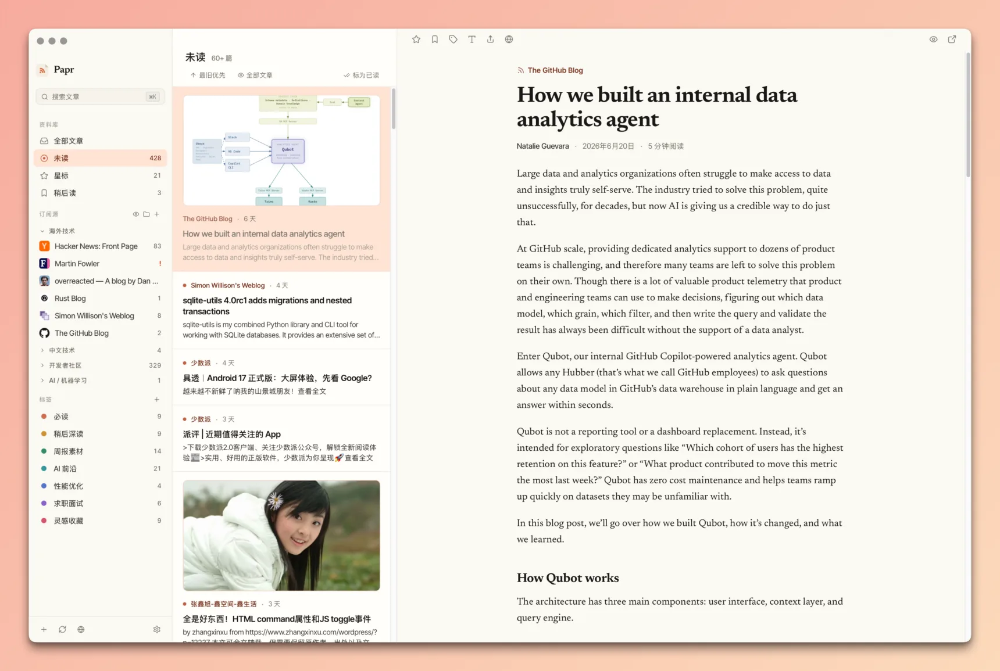

<div align="center">


# Papr

**A fast, native RSS reader — and a CLI your AI agent can actually drive.**



</div>

Papr is two front-ends over **one local database**:

- **A desktop reader** — fast, native, offline-first. No account, no cloud.
- **`papr`, an agent-facing CLI** — so an autonomous agent (Claude Code, Codex,
  OpenCode…) can read, search and triage your feeds straight from the shell.
  [Jump to it ↓](#papr--your-feeds-handed-to-your-agent)

Both read the same database through the shared `papr-core` crate, so the app and
the CLI can never drift apart.

---

## The desktop app

- **Feeds & folders** — subscribe, organize, and import/export OPML.
- **Smart views** — All, Unread, Starred, and Read Later, with live counts.
- **Tags & rules** — color-coded tags and rules that tag new articles automatically.
- **Full-text** — fetch and clean the complete article when a feed ships only a summary.
- **AI** — summaries, ask-the-article Q&A, and digests. Bring your own API key.
- **Audio** — a built-in player that follows you from article to article.
- **FreshRSS sync** — keep read state in step with a FreshRSS server.
- **Local-first** — everything stays on your machine. No account, no cloud.
- **Localized** — English, Japanese, and Simplified Chinese.

### Install

| Platform | How |
| --- | --- |
| **macOS** | `brew install --cask l0ng-ai/papr/papr` — or grab the `.dmg` |
| **Windows** | Download the `.msi` installer |
| **Linux** | Download the `.AppImage` or `.deb` |

All packages live on the **[latest release](https://github.com/l0ng-ai/papr/releases/latest)**.
The macOS builds are Developer ID signed and notarized.

---

## `papr` — your feeds, handed to your agent

This is what makes Papr different. `papr` is a command-line companion built **for
autonomous agents** to drive over the shell. Point your agent at it and it can
work your feeds with no GUI:

- **Read** — `feeds`, `list`, `read`, full-text `search`
- **Triage** — `mark` read/star/later, `extract` full text, `refresh`
- **Manage** — subscriptions, folders, tags, rules, highlights, OPML
- **Sync** — FreshRSS / Miniflux

Run bare `papr` and it prints your unread dashboard *plus the next useful
commands*, so the agent orients with zero manual. Output is
[TOON](https://toonformat.dev) — ~40% fewer tokens than JSON — with definitive
counts and structured exit codes.

```console
$ papr
unread: 206   starred: 17   later: 0   feeds: 15
articles[10]{id,feed,title,flags,date}:
  3664,V2EX,[Java] 使用 kkRepo 搭建 Maven 私服,unread.star,"2026-06-25"
  ...
help[4]: Run `papr read <id>` to read an article's full text, ...
```

### Hand it to your agent — one line

The bundled **[`papr-rss` skill](skills/papr-rss/SKILL.md)** loads *on demand*
when an agent recognizes a feed-related task, so it costs nothing until you use
it. Install it with [`skills`](https://github.com/vercel-labs/skills):

```sh
npx skills add https://github.com/l0ng-ai/papr/tree/main/skills/papr-rss
```

Want the agent *proactively* aware of your feeds every conversation? `papr setup`
wires up an ambient SessionStart hook (Claude Code, Codex, OpenCode).

### Install the CLI

| Platform | How |
| --- | --- |
| **macOS / Linux** | `brew install l0ng-ai/papr/papr-cli` |
| **Windows** | Download `papr-x86_64-pc-windows-msvc.zip`, unzip, drop `papr.exe` on your `PATH` |
| **Any** | Prebuilt `papr-<target>.tar.gz` from the [latest release](https://github.com/l0ng-ai/papr/releases/latest), or `cargo build --release -p papr-cli` |

> **Full command reference, agent setup, and install options → [docs/cli.md](docs/cli.md)**
